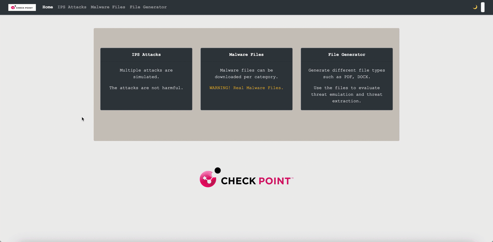

# Threat Prevention Demo Server

A Flask-based Check Point threat-prevention demo/data server for exercising security controls in a lab — trigger IPS signatures, download real (encrypted-at-rest) malware samples, generate Threat Emulation test files, and run the guided **AI Factory** demo that shows Access Control, Anti-Virus, and IPS protecting an AI factory across a Check Point AIFF (BlueField-3 DPU).


Part of the [Dev Hub](https://github.com/alshawwaf/dev-hub) ecosystem — deploy the whole suite with [ubuntu-dokploy-ai](https://github.com/alshawwaf/ubuntu-dokploy-ai).

> Display name: **Threat Prevention Demo Server**. The repository is being renamed to `threat-prevention-demo-server` (rename it in GitHub → Settings; the clone URL and image references below update to match). Some internal identifiers (log file, `.p12` certificate, package folder) still use the old `cp_demo_server` name and are left as-is to avoid breakage.

---

## Overview

Threat Prevention Server is a self-contained target/generator for validating Check Point threat-prevention blades during a PoV or lab. Point a gateway at it and you can:

- Fire 40+ IPS protection signatures at a chosen target IP to generate logs and prove blocking.
- Browse and download 225 real malware samples (stored encrypted, decrypted only in memory at download) to test Anti-Virus / URL filtering.
- Generate Threat Emulation test files across 14 formats with configurable malicious payloads, and optionally email them as attachments.
- Serve HTTPS-inspection helper material and IoC feeds for endpoint / threat-intel demos.

Every route sits behind a login, and every malware sample is AES-128 encrypted at rest so the host AV never sees plaintext signatures.

---

## Features

| Module | Description |
|--------|-------------|
| **IPS Attacks** (`/ips`) | Trigger 40+ IPS protection signatures against a target IP; also exposed as a JSON API (`POST /api/run_attack`) |
| **Malware Files** (`/av`) | Browse and download 225 real malware samples across 14 categories, decrypted in memory on download |
| **File Generator / Threat Emulation** (`/te`) | Generate malicious test files in 14 formats with configurable payloads |
| **Email Delivery** | Send generated files as SMTP attachments using UI-configured mail settings |
| **HTTPS Inspection & IoC** (`/https_inspection`) | Certificate download plus IoC CSV/PDF/DOCX feeds for inspection and threat-intel demos |
| **JSON API + Swagger** | Every route is documented in the Swagger UI at `/apidocs/` |

---

## Screenshots



---

## Modules

### IPS Attacks (`/ips`)

Trigger Check Point IPS signatures against a configured target IP. Ships with 40+ protections loaded from `app/data/ips_protections_demo.csv`. The saved target IP is stored in the session so you can fire signatures one after another. Also available as JSON:

```bash
curl -X POST http://localhost:8080/api/run_attack \
  -H "Content-Type: application/json" \
  -b cookies.txt \
  -d '{"protection_name": "SQL Injection Scanning Attempt", "target_ip": "192.168.1.1"}'
```

> `protection_name` must match a name from `app/data/ips_protections_demo.csv` exactly. The endpoint requires an authenticated session (log in first and pass the session cookie).

### Malware Files (`/av`)

Browse and download real malware samples across 14 categories. Files are decrypted in memory on download — your AV only ever scans the encrypted `.enc` blobs on disk:

```
Banking-Malware  Email-Worm  Joke     Net-Worm  Pony       RAT
Ransomware       Spyware     Stealer  Trojan    Virus      Worm
eicar            rogues
```

### File Generator / Threat Emulation (`/te`)

Generate malicious test files in these formats:

```
pdf  docx  pptx  xlsx  rtf  exe  exe-64bit  elf  dylib  jpg  png  bmp  gif  tiff
```

Optional payload embeddings: URLs, scripts, images, video, audio, 3D content, embedded PDF, external-app links, sensitive links, and data-submission forms. Generated files can be downloaded, deleted, or emailed as attachments.

> **Note — network attack generator:** `app/attack_generator.py` contains a Scapy-based proof-of-concept for raw network attacks (ICMP/SYN/UDP flood, Ping of Death, ARP poisoning, DNS spoofing, DHCP starvation, HTTP flood, NTP amplification, Slowloris). It is **not exposed** through any route or the navbar. Treat it as reference code only; the running app surfaces the modules above.

---

## Quick start — Docker (recommended)

```bash
git clone -b GA https://github.com/alshawwaf/cp_demo_server.git
cd cp_demo_server
docker build -t cp_demo_server:latest .
docker run -d --name cp_demo_server -p 8080:8080 --restart unless-stopped cp_demo_server:latest
```

Open **http://localhost:8080** and log in (see [Configuration](#configuration)).

> Malware samples are pre-encrypted in the repo — no extra steps: clone, build, run.

## Quick start — local Python

```bash
# System dependencies (Debian/Ubuntu)
sudo apt update && sudo apt install -y \
  python3-venv build-essential gcc libcurl4-openssl-dev mingw-w64

python3 -m venv venv
source venv/bin/activate
pip install -r requirements.txt
python run.py
```

Open **http://127.0.0.1:8080**. `run.py` initializes the SQLite databases and loads the IPS protection CSV on startup.

---

## Deployment

This app deploys automatically as part of the [Dev Hub](https://github.com/alshawwaf/dev-hub) suite via [ubuntu-dokploy-ai](https://github.com/alshawwaf/ubuntu-dokploy-ai), reachable at **threat.&lt;your-domain&gt;**.

The repo ships a [`docker-compose.dokploy.yml`](docker-compose.dokploy.yml) that builds the image and wires the admin credentials from environment variables:

```yaml
services:
  cp-demo-server:
    build: .
    environment:
      - ADMIN_USERNAME=${ADMIN_USERNAME:-admin}
      - ADMIN_PASSWORD=${ADMIN_PASSWORD}
    restart: unless-stopped
```

Set `ADMIN_PASSWORD` (and optionally `ADMIN_USERNAME`) in the Dokploy environment for the service. The container listens on port **8080**; Traefik/Dokploy handles TLS termination and routing.

---

## Configuration

| Variable | Default | Description |
|----------|---------|-------------|
| `ADMIN_USERNAME` | `admin` | Username for the single admin login |
| `ADMIN_PASSWORD` | `Cpwins@2026!1` | Password for the admin login — **override in any shared deployment** |

Email delivery is configured at runtime from the UI (**File Generator → email settings**) and persisted to `app/data/email_config/email_config.json` (SMTP server, port, encryption type, sender, default recipient, subject, body) — not via environment variables.

---

## Security design

### Login protection

All routes are wrapped by a `login_required` decorator and require an authenticated session. The server uses a single admin account whose password is stored only as a Werkzeug hash in memory; override the defaults with `ADMIN_USERNAME` / `ADMIN_PASSWORD`.

### Malware samples — encrypted at rest

All 225 malware samples are stored **AES-128 encrypted** (Fernet: AES-128-CBC + HMAC-SHA256) as `.enc` files, both on disk and in this repository — the host AV never sees plaintext signatures.

- Files are decrypted **in memory only** at download time; plaintext never touches the filesystem.
- The encryption key lives at `app/data/.secret.key` (auto-generated on first use if absent).
- To encrypt newly added samples: `python scripts/encrypt_samples.py`.

---

## Remote testing scripts

```bash
# Test IPS protections against a firewall
python tests/trigger_attacks.py \
  --server http://SERVER_IP:8080 \
  --target TARGET_IP \
  --file tests/protections_example.txt

# Test malware download blocking (streamed, never saved to disk)
python tests/test_malware_downloads.py \
  --server http://SERVER_IP:8080 \
  --file tests/malware_files_example.txt
```

Both routes require an authenticated session — see [tests/README.md](tests/README.md) for details.

---

## Adding new malware samples

```bash
# Copy plaintext files into the appropriate category directory
docker cp ./new_samples/. cp_demo_server:/usr/src/app/app/data/malware_samples/Category/

# Encrypt in-place inside the container (originals removed)
docker exec cp_demo_server python scripts/encrypt_samples.py

# Copy the encrypted files back and commit (never commit plaintext)
docker cp cp_demo_server:/usr/src/app/app/data/malware_samples/. app/data/malware_samples/
git add app/data/malware_samples/
git commit -m "Add new encrypted samples"
```

---

## API documentation

Interactive Swagger UI is available at **`/apidocs/`** (Flasgger). Every route carries an OpenAPI docstring.

---

## Optional: TLS certificate

`run.py` runs plain HTTP by default (TLS is terminated upstream by Traefik/Dokploy). To run the Flask server directly over HTTPS, generate a cert and uncomment the `ssl_context` line in `run.py`:

```bash
openssl req -x509 -newkey rsa:4096 -nodes \
  -out app/data/certificate/cert.pem \
  -keyout app/data/certificate/key.pem -days 365 \
  -subj "/C=CA/ST=ON/L=Ottawa/O=Demo/CN=localhost"
```

---

## Optional: run as a systemd service

```bash
sudo tee /etc/systemd/system/cp_demo_server.service > /dev/null << 'EOF'
[Unit]
Description=Threat Prevention Server
After=network.target

[Service]
User=YOUR_USER
WorkingDirectory=/path/to/cp_demo_server
ExecStartPre=/bin/sh -c 'test -x venv/bin/python3 || (python3 -m venv venv && venv/bin/pip install -r requirements.txt)'
ExecStart=/path/to/cp_demo_server/venv/bin/python3 run.py
Restart=always
RestartSec=3

[Install]
WantedBy=multi-user.target
EOF

sudo systemctl daemon-reload
sudo systemctl enable --now cp_demo_server
```

> The `ExecStartPre` line self-heals a missing/broken venv (venvs are not portable and break after an OS/Python upgrade — status `203/EXEC`). Tail logs with `journalctl -u cp_demo_server -f`.

---

## Tech stack

| Layer | Technology |
|-------|------------|
| Web framework | Flask 3.1 |
| Encryption | cryptography (Fernet — AES-128-CBC + HMAC-SHA256) |
| UI | Bootstrap 5 + Bootstrap Icons + DataTables |
| Database | SQLite |
| API docs | Flasgger (Swagger) |
| File generation | ReportLab, python-docx, python-pptx, openpyxl/XlsxWriter, Pillow, PyRTF3, PyInstaller |
| Network simulation | Scapy (reference only) |
| Email | Flask-Mail |
| Container | Docker (`python:3.12-slim`, non-root user) |

---

## Project structure

```
cp_demo_server/
├── app/
│   ├── data/
│   │   ├── .secret.key              # Fernet key for malware samples
│   │   ├── malware_samples/         # 225 samples stored as .enc files (14 categories)
│   │   ├── generated_files/         # TE-generated downloadable files
│   │   ├── ioc_files/               # IoC CSV/PDF/DOCX test files
│   │   ├── certificate/             # TLS/SSL certificate + p12
│   │   ├── email_config/            # SMTP configuration (JSON)
│   │   └── ips_protections_demo.csv # IPS protection catalog
│   ├── templates/                   # login, base, index, ips, av, te, https_inspection
│   ├── static/                      # CSS, JS, favicon, logos
│   ├── crypto_util.py               # At-rest encryption/decryption (Fernet)
│   ├── views.py                     # All route handlers
│   ├── file_generator.py            # TE file generation logic
│   ├── attack_generator.py          # Scapy network attack PoC (not routed)
│   ├── db.py                        # SQLite helpers + CSV loader
│   └── email_service.py            # Flask-Mail wrapper
├── scripts/
│   └── encrypt_samples.py           # Encrypt new malware samples in-place
├── tests/                           # Remote IPS + malware-download test scripts
├── docker-compose.dokploy.yml       # Dokploy deployment
├── Dockerfile
├── requirements.txt
└── run.py                           # Entry point (init DBs, load CSV, serve on :8080)
```
